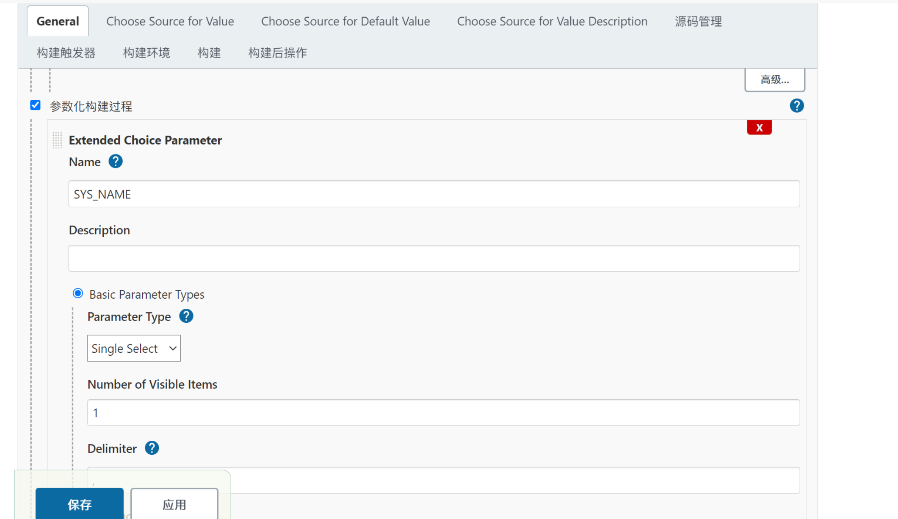
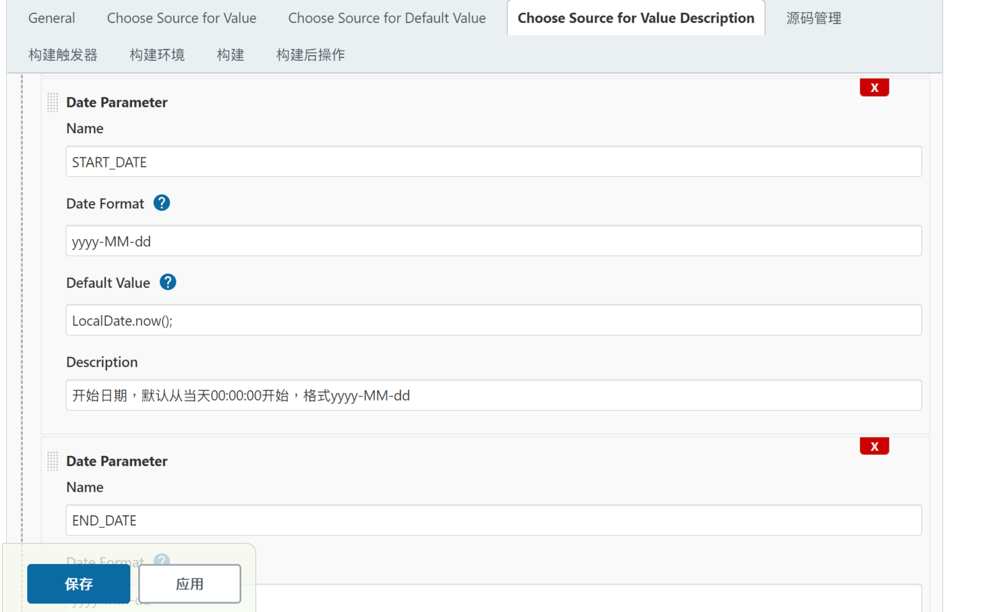
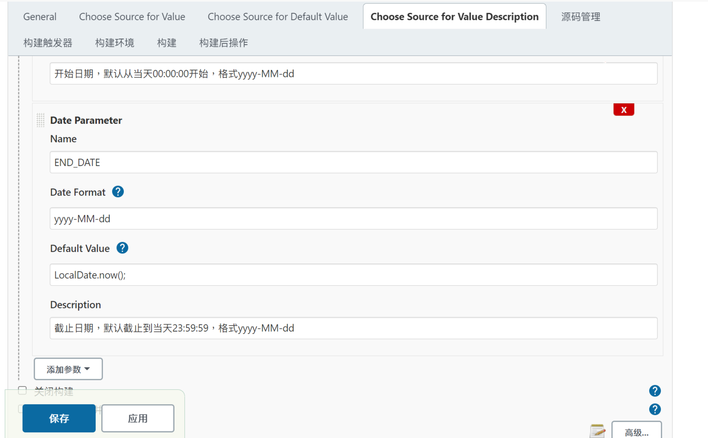
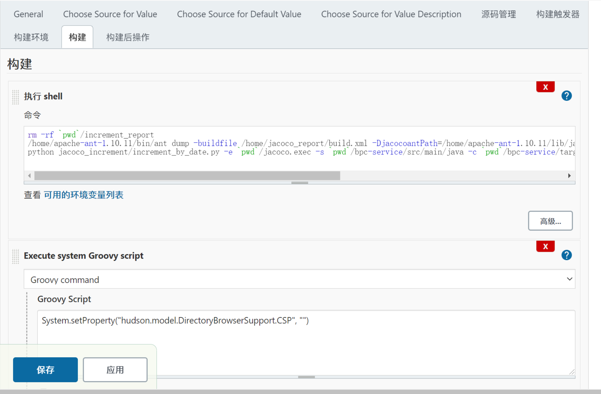
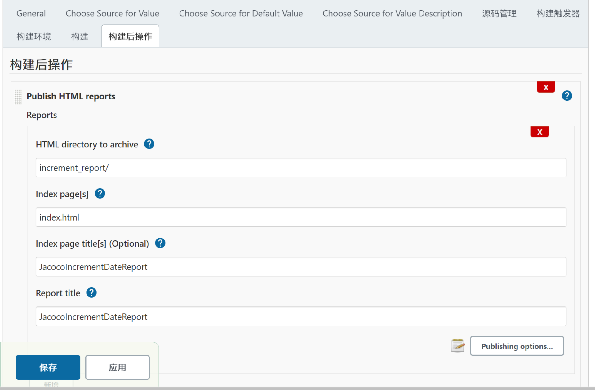

### jenkins 获取增量代码
#### 需要配合[code-diff](https://github.com/howrain/code-diff/) 和 [jacoco二开](https://github.com/howrain/jacoco) 使用
#### 1.获取svn日期区间的差异
在jenkins中配置checkout此项目，并在jenkins中配置参数化构建，分别配置SYS_NAME、START_DATE、END_DATE

+ SYS_NAME：对应config.hjson中的sys_info下系统名称，用于读取该系统的相关配置
+ START_DATE和END_DATE为检索增量代码的起止日期(格式为yyyy-MM-DD，对应code-diff项目中的接口入参)







在jenkins添加构建步骤，执行脚本`increment_by_date.py`，执行脚本前最好调用jacoco获取最新的jacoco.exec，调用命令参考：

```python jacoco_increment/increment_by_date.py -e `pwd`/jacoco.exec -s `pwd`/bpc-service/src/main/java -c `pwd`/bpc-service/target/classes -r `pwd`/increment_report --projectname=bpc --appname=bpc_service --envname=UAT```

参数说明
+ -e ：jacoco.exec 报告文件的路径
+ -s ：java源码的路径（注：路径下只能包含java文件）
+ -c ：class文件的路径（注：路径下只能包含class文件）
+ -r ：生成报告的路径
+ --projectname ：项目名称
+ --appname ：app名称
+ --envname ：环境名称



jenkins中展示html报告可以使用Publish HTML reports插件



#### 2.获取svn jira任务号的差异
使用方法与 "获取svn日期区间的差异" 基本一致，在jenkins中配置参数化构建，分别配置SYS_NAME、JIRA_TASK、DAYS_AGO
+ SYS_NAME：对应config.hjson中的sys_info下系统名称，用于读取该系统的相关配置
+ JIRA_TASK：要查询的任务号，多个以 "," 分隔
+ DAYS_AGO：默认查询svn日志最长的天数（默认最好是365天）

同样在jenkins中配置构建步骤，调用脚本`increment_by_jira.py`，执行脚本前最好调用jacoco获取最新的jacoco.exec，调用命令参考：

```python jacoco_increment/increment_by_jira.py -e `pwd`/jacoco.exec -s `pwd`/bpc-service/src/main/java -c `pwd`/bpc-service/target/classes -r `pwd`/increment_report --projectname=bpc --appname=bpc_service --envname=UAT```

参数含义同 "获取svn日期区间的差异"

#### 3.配置文件
配置文件在`resources`下`config.hjson`，默认有一个模板配置`config.hjson.template`，请自行参考，并复制为`config.hjson`

`code_diff`说明
+ url : code-diff服务 地址
+ code_diff_svn_jira_api : “svn同分支获取Jira任务号差异代码”接口地址
+ code_diff_svn_date_api : “svn同分支获取日期区间差异代码”接口地址

`sys_info`说明
+ 系统名称 : 该名称自定义，可以多个
+ vcs_type : 版本管理工具类型（svn、git）
+ vcs_url : 版本管理工具地址
+ vcs_username : 版本管理工具账号
+ vcs_password : 版本管理工具密码

#### 4.jacoco生成报告
`resources`下的`org.jacoco.cli-0.8.7-SNAPSHOT-nodeps.jar`为jacoco二开项目打包出来的，如果后续有修改调整，请自行替换
